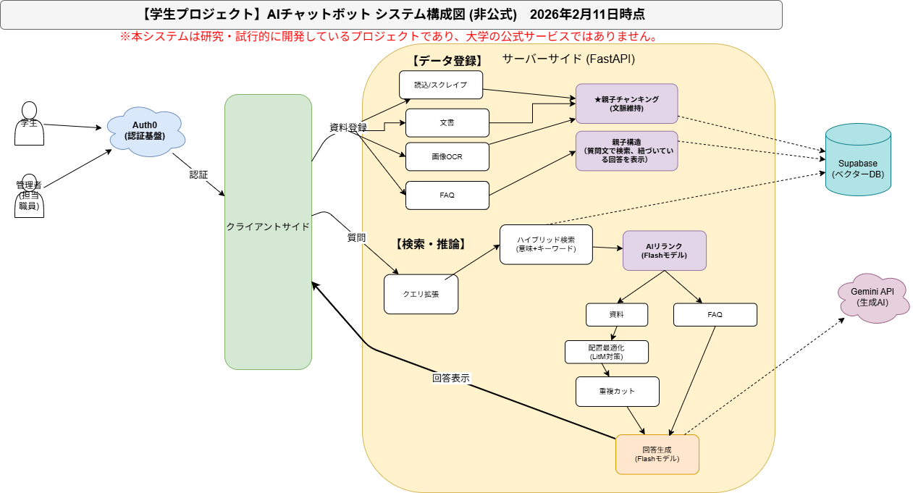

# 🎓 AIチャットボットシステム

Retrieval-Augmented Generation (RAG) を活用した、学生支援チャットボットプラットフォームです。
単なる問い合わせの自動化に留まらず、現場主導で学生支援体制を改善し続けるための基盤として設計されています。

※本システムは研究・試行的に開発しているものであり、学内公式ではありません。

---

## 🚀 主な機能

- **🤖 AI質問応答 (RAG)**
  大学サイトやマニュアル等の公式資料に基づき、自然言語で学生の質問に回答します。

- **🧠 AI業務改善アドバイザー (New)**
  学生とAIの過去の対話ログを分析し、職員に対して「学生の悩み」の抽出や「窓口対応の改善案」を提案します。

- **📊 統計・分析ダッシュボード**
  フィードバックの統計グラフと、AIとの改善相談チャットを統合した管理者用インターフェースを提供します。

- **🔐 セキュアなアクセス制御**
  Auth0連携により、特定のユーザーのみにアクセスを制限します。

- **⚙️ 現場主導のナレッジ管理**
  技術者に頼らず、職員自身がRAG対象ドキュメントを更新・修正できる設計にしています。

---

## 🏗️ システム構成

- **フロントエンド層**: 
HTML / JavaScript / WebSocket (リアルタイム設定反映)
- **アプリケーション層**:
FastAPI (Python) / Gemini API / Auth0 (OAuth2.0)
- **データベース層**: 
Supabase (PostgreSQL + pgvector)
- **インフラ・監視層**: 
Render / Docker / LangSmith / UptimeRobot(トレース・評価)

---

## 📂 プロジェクト構成

```text
.
├── main.py                  # アプリケーション本体、Lifespan管理、各ルーターの登録 
├── static/                  # 静的ファイル (フロントエンド)
│   ├── client.html          # 学生用チャット画面 
│   ├── admin.html           # 管理者用ダッシュボード 
│   ├── DB.html              # ナレッジベース(DB)管理画面 
│   ├── stats.html           # 統計・AI改善相談画面 
│   ├── style.css            # アプリ全体のスタイルシート 
│   ├── admin.js             # 管理者用「コマンドセンター」ロジック (New) 
│   └── client.js            # 学生用UI制御・対話ロジック (New) 
│
├── api/                     # APIエンドポイント (FastAPIルーター)
│   ├── __init__.py          # パッケージ初期化 
│   ├── auth.py              # Auth0認証・HTML提供 
│   ├── chat.py              # チャット・履歴 API 
│   ├── documents.py         # ナレッジ管理・安全なWebスクレイピング API 
│   ├── fallbacks.py         # Q&A管理 API (New) 
│   ├── feedback.py          # フィードバック収集 API (New) 
│   ├── system.py            # 設定・ヘルスチェック・コレクション管理 
│   └── stats.py             # 統計・AI分析 API 
│
├── services/                # ビジネスロジック
│   ├── __init__.py          # パッケージ初期化 
│   ├── chat_logic.py        # メインフロー制御・履歴管理 
│   ├── chat_log.py          # 対話ログの保存・永続化処理
│   ├── search.py            # クエリ拡張・リランク・Lost in the Middle対策 
│   ├── llm.py               # Gemini API連携・Tenacityリトライ処理 
│   ├── prompts.py           # プロンプト一元管理 
│   ├── document_processor.py # テキスト抽出・チャンキング 
│   ├── feedback.py          # フィードバック保存・集計ロジック (New) 
│   ├── storage.py           # Supabaseストレージ操作・署名付きURL生成 (New) 
│   ├── vectorize_logs.py    # ログ・コメントの分析用ベクトル化サービス (New) 
│   ├── text_processor.py    # テキスト洗浄・XSS対策・正規化 (New) 
│   └── utils.py             # 汎用ヘルパー (URLリンク化など) (New) 
│
├── core/                    # 中核設定・コンポーネント
│   ├── __init__.py          # パッケージ初期化 
│   ├── database.py          # SupabaseClientManager (接続管理) 
│   ├── config.py            # 環境変数・定数・OAuth定義 
│   ├── settings.py          # Settings/ConnectionManager (New) 
│   ├── constants.py         # 固定メッセージ・設定値の一元管理 (New) 
│   ├── dependencies.py      # 認証依存関係 (require_auth) 
│   └── ws_auth.py           # WebSocket用の検証関数 (New) 
│
└── models/                  # データモデル
    ├── __init__.py          # パッケージ初期化 
    └── schemas.py           # Pydanticリクエスト/レスポンスモデル

🛠️ セットアップ
1. 環境変数の設定
.env ファイルに以下の設定が必要です。
# --- 基本設定 & セキュリティ ---
APP_SECRET_KEY=your_secret_key_here

# --- 管理者設定 ---
SUPER_ADMIN_EMAILS=admin@example.com

# --- AI & LLM (Gemini) ---
GEMINI_API_KEY=your_gemini_api_key

# --- データベース (Supabase) ---
SUPABASE_URL=your_supabase_url
SUPABASE_SERVICE_KEY=your_supabase_service_key

# --- 監視 ---
LANGCHAIN_TRACING_V2=true
LANGCHAIN_API_KEY=your_langchain_api_key

2. ローカル開発 (Docker)
# 初回起動、または requirements.txt 変更時
docker compose up --build

# 2回目以降（コード修正のみの場合）
docker compose up

🔒 セキュリティと運用ビジョン
自律的な改善サイクル
日常的な運用の中で現場職員が「回答の不十分さ」に気づいた際、即座に知識ベースを修正できる体制を支援します。

対話ログの資産化
学生とのやり取りを蓄積し、システム自身が改善案を提示する「相談パートナー」へと進化させることで、教職員の支援態勢アップデートを加速させます。

📈 今後の展望
音声入力インターフェースの実装

ログデータのベクトル検索化（より長期的な傾向分析のため）